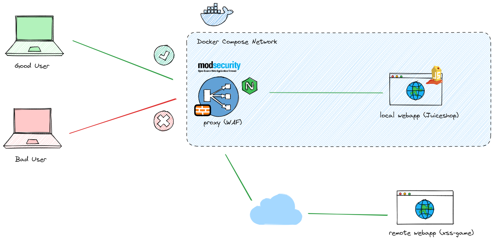

# TPE-Redes
Este repositorio contiene la configuración y los archivos necesarios para implementar un Web Application Firewall (WAF) utilizando ModSecurity, en conjunto con un servidor proxy reverso. El objetivo de este proyecto es proporcionar una capa de seguridad adicional para aplicaciones web, protegiéndolas contra diversos tipos de ataques.

Los pasos que seguiremos para implementar el sistema son los siguientes:

1. Configurar un servidor Proxy que funcione como proxy reverso para recibir las peticiones para al menos 2 servidores con web server
2. Configurar un servidor con ModSecurity que reciba las redirecciones del Proxy y chequee la seguridad de las mismas
3. Configurar al menos 3 reglas de solo detección para realizar análisis
4. Configurar al menos 3 reglas de bloqueo
5. Probar al menos 3 ataques para mostrar la respuesta del waf, configurar un página default de respuesta ante detección de anomalía.

## Requerimientos

Para poder levantar el proyecto es necesario contar con lo siguiente
- `docker`
-  `docker compose`

## Herramientas

### ModSecurity
Es el motor del WAF que analiza el tráfico HTTP que pasa a través del proxy reverso. nos permite configurar reglas específicas para detectar y bloquear patrones de ataque, asegurando que solo el tráfico seguro llegue a los servidores web. Tambien se pueden configurar reglas de solo deteccion para poder monitorear ciertas requests.

### Nginx
En este proyecto esta configurado como proxy reverso, el servidor nginx recibe todas las requests entrantes y las redirige a los servidores web. ModSecurity se configura como un modulo del proxy asi puede acceder al trafico HTTP. 

### Docker y Docker compose
Los utilizamos para definir y ejecutar el entorno completo del WAF, incluyendo Nginx con ModSecurity y una webapp local, dentro de contenedores. Estas herramientas permiten poder levantar el sistema de forma consistente sin preocuparnos por el entorno.

## Arquitectura

Este es un diagrama de la arquitectura de la solución del proyecto, donde el servidor proxy reverso funciona como un WAF para proteger dos aplicaciones web: una dentro de la red del WAF y otra alojada en Internet. Si se configura correctamente, un usuario malicioso no podrá atacar las aplicaciones web, mientras que un usuario normal debería poder utilizar las aplicaciones sin problemas.



# Instrucciones

## Configurar el servidor proxy
A continuación se detallan los pasos para configurar el servidor proxy para que funcione como un proxy reverso para recibir las peticiones para al menos 2 servidores con web server.
### Construccion

Como mencionamos anteriormente, el servidor proxy se ejecuta en un contenedor de Docker. Para crear este contenedor, utilizamos el Dockerfile ubicado en `./proxy/Dockerfile`. La construcción de un contenedor con Nginx se realiza de la siguiente manera:

```Dockerfile
# A partir de un linux
FROM ubuntu:latest

# Instalamos nginx
RUN apt-get update &&           \
    apt-get install -y nginx=1.24.0-2ubuntu7

#.....otras directivas

# Escuchamos en el puerto 80
EXPOSE 80

# Corremos nginx en primer plano
CMD ["nginx", "-g", "daemon off;"]
```

### Configuracion

Dentro de la carpeta `./proxy/sites/`, tenemos dos archivos de configuración para los sitios web Juiceshop y XSS-Game en Nginx.

Para la aplicación Juiceshop, el archivo de configuración `juiceshop.conf` se configura de la siguiente manera:

```Nginx
server {
    # Puerto y nombre de host
    listen       80;
    server_name juiceshop.local;
    
    #.....otras directivas
    
    location / {
        # Aquí especificamos a dónde se enviarán las solicitudes entrantes.
        proxy_pass http://webapp:3000;
        
        # Configuramos algunos encabezados para enviar al servidor web.
        proxy_set_header Host webapp;
        
        # Indicamos al servidor backend que la URL de referencia es 'http://webapp:3000'.
        proxy_set_header Referer http://webapp:3000;

        # Configuración de encabezados HTTP con informacion util para el servidor web.
        proxy_set_header User-Agent $http_user_agent;
        proxy_set_header X-Real-IP $remote_addr;
        proxy_set_header Accept-Encoding "";
        proxy_set_header Accept-Language $http_accept_language;
        proxy_set_header X-Forwarded-For $proxy_add_x_forwarded_for;
    }

    #.....otras directivas
}
```

Notar que la URL especificada en proxy_pass es `http://webapp:3000`. Como mencionamos anteriormente, el servidor Juiceshop se ejecuta en un contenedor dentro de la misma red de Docker Compose que el proxy. Por lo tanto, Docker Compose nos permite resolver el nombre webapp a la dirección IP del contenedor correspondiente.

Para la aplicación XSS-Game, el archivo de configuración `xss-game.conf` tiene una configuración similar pero apunta a otro sitio:

```Nginx
server {
    listen 80;
    server_name xss-game.local;

    #.....otras directivas

    location / {
        proxy_pass https://xss-game.appspot.com;

        proxy_set_header Host xss-game.appspot.com;
        proxy_set_header Referer https://xss-game.appspot.com;

        proxy_set_header User-Agent $http_user_agent;
        proxy_set_header X-Real-IP $remote_addr;
        proxy_set_header Accept-Encoding "";
        proxy_set_header Accept-Language $http_accept_language;
        proxy_set_header X-Forwarded-For $proxy_add_x_forwarded_for;
    }

    #.....otras directivas
}
```

Estos archivos de configuración determinan cómo Nginx manejará las solicitudes entrantes para cada sitio web, redirigiéndolas al servidor correspondiente y configurando los encabezados necesarios para la comunicación con el servidor web.

## Agregar ModSecurity
A continuación se detallan los pasos para agregar ModSecurity al servidor proxy para que este pueda cumplir la funcion de un WAF.

### Construccion
ModSecurity funciona como un modulo para nginx por lo tanto se debe agregar al Dockerfile del proxy directivas que instalaran ModSecurity y lo configuraran como modulo de nginx. El Dockerfile en `./proxy/Dockerfile` quedara asi:

```Dockerfile
#.....otras directivas

# Instalamos las dependencias necesarias para el módulo de modsecurity
RUN apt-get install -y gcc make build-essential autoconf automake libtool libcurl4-openssl-dev \
    liblua5.3-dev libfuzzy-dev ssdeep gettext pkg-config libgeoip-dev libyajl-dev doxygen \
    libpcre3-dev libpcre2-16-0 libpcre2-dev libpcre2-posix3 zlib1g zlib1g-dev git

# Descargamos modsecurity del repositorio oficial en /opt
WORKDIR /opt
RUN git clone https://github.com/owasp-modsecurity/ModSecurity.git

# Instalamos modsecurity, aqui se compilara desde 0 modsecurity
WORKDIR /opt/ModSecurity
RUN git submodule init
RUN git submodule update
RUN ./build.sh
RUN ./configure
RUN make
RUN make install

# Descargamos el conector que conecta nginx con ModSecurity
WORKDIR /opt
RUN git clone https://github.com/owasp-modsecurity/ModSecurity-nginx.git

# Compilamos el modulo utilizando el conector
WORKDIR /opt
RUN wget https://nginx.org/download/nginx-1.24.0.tar.gz
RUN tar -xvzf nginx-1.24.0.tar.gz
WORKDIR /opt/nginx-1.24.0
RUN ./configure --with-compat --add-dynamic-module=/opt/ModSecurity-nginx
RUN make modules

# Copiamos el módulo a la carpeta de módulos de nginx para que este pueda accederlo
RUN cp objs/ngx_http_modsecurity_module.so /etc/nginx/modules-enabled/

# Copiamos la configuracion default
RUN cp /opt/ModSecurity/modsecurity.conf-recommended /etc/nginx/modsecurity.conf
RUN cp /opt/ModSecurity/unicode.mapping /etc/nginx/unicode.mapping

# Configuramos nginx para que cargue el módulo de modsecurity
# Esto lo hacemos con un prepend
RUN printf '%s\n%s\n' "load_module /etc/nginx/modules-enabled/ngx_http_modsecurity_module.so;" "$(cat /etc/nginx/nginx.conf)" > /etc/nginx/nginx.conf

#.....otras directivas

```

### Configuracion

Dentro del directorio `./proxy/modsecurity`, se encuentra el archivo de configuración predeterminado de ModSecurity en `modsecurity.conf`. Este archivo contiene la configuración principal de ModSecurity, que incluye reglas de seguridad, configuraciones de auditoría y otras directivas importantes para proteger las aplicaciones web contra ataques comunes.

De forma predeterminada Modsecurity no bloquea el trafico malicioso, solamente lo detecta y lo loguea. Para que modsecurity bloquee el trafico cambiamos la directiva `SecRuleEngine`. El archivo donde se mandan los logs se especifica con la directiva `SecAuditLog`.

```
#.....otras directivas

# La directiva predeterminada era: SecRuleEngine DetectionOnly
SecRuleEngine On 

# Con esta directiva especificamos donde se guardan los logs
SecAuditLog /var/log/modsec_audit.log

#.....otras directivas
```

Listo! Ya tenemos lo necesario para levantar el WAF, ahora podemos configurar algunas reglas


---
para armar los contenedores se debe ejecutar el siguiente comando
```sh
docker compose build
```

una vez armadas las imagenes podemos ejecutarlas utilizando
```sh
docker compose up -d
```

para poder ver las paginas a las que le hacemos reverse proxy, primero necesitamos agregar las siguientes lineas a /etc/hosts
```sh
echo -e "127.0.0.1 juiceshop.local\n127.0.0.1 xss-game.local" | sudo tee -a /etc/hosts > /dev/null
```

luego podremos utilizar curl o acceder desde el browser a los urls `juiceshop.local` y `xss-game.local`
